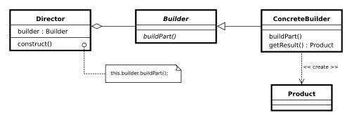

# Creational Design Patterns

## Singleton
Това е Design Pattern, който нарушава някой от ООП принципи (и SOLID _single responsibility_). Затова този патърн носи със себе си 'тежести', проблеми за отстраняване.

* **Мотивация:**
	- Използва се за неща, които са глобални и единствени за приложението

* **Цел:**
	- Подсигурява се създаването от класа на единствена инстанция и също глобален достъп до нея

* **Приложение:**
	- Highscore (в игрите)
	- file system

* **Известни употреби:**
	- window manager, file system, logger

* **Имплементация** (реално изпълнение)
	* Singleton - First version

	~~~c#
	public sealed class Singleton
	{
	    private static Singleton instance = null;

	    private Singleton()
	    {
	    }

	    public static Singleton Instance
	    {
	        get
	        {
	            if (instance==null)
	            {
	                instance = new Singleton();
	            }
	            return instance;
	        }
	    }
	}
	~~~

	* Singleton - Second version _simple thread-safety_
	Becouse two different threads could both have evaluated the test if (instance == null) and found it to be true.

	~~~c#
	public sealed class Singleton
	{
	    private static Singleton instance = null;
	    private static readonly object padlock = new object();

	    Singleton()
	    {
	    }

	    public static Singleton Instance
	    {
	        get
	        {
	            lock (padlock)
	            {
	                if (instance == null)
	                {
	                    instance = new Singleton();
	                }
	                return instance;
	            }
	        }
	    }
	}
	~~~

* **Участници**
	- В общия случай не се разрешени настройки на параметрите

* **Последствия**
	* базовата имплементация (non thread-safe)
		не може да се използва в многонишкова среда

	* tight coupling
		зависим от този клас (_Singleton_)

* **Структура**

* **Проблеми**
	- Да не се създава предварително, а в първият момент когато бъде извикана инстанцията
	- Използването на няколко нишки
	- Много силен каплинг

---------------
## Builder

* **Мотивация:**
	Създава обекти, за които има на друго място изградена логика за последователността на вграждане на елементи. 'Builder' се използва, като интерфейс и по този начин се спестява допълнителната информация от съставните елементи.

* **Цел:**
	- Разделяне на сложен обект на неговите съставни (представителни) елементи, така че същият конструктор да може да създаде обект и от други съставни елементи

	- Чрез използването на сложни съставни елементи, трябва да може да се създаде една от няколко цели

* **Приложение:**
	- Постъпково изпълнение на нещо

* **Известни употреби:**
	- конструирането на HTML докимент

* **Имплементация** (реално изпълнение)

	~~~c#
	using System;
	using System.Collections;

	  public class MainApp
	  {
	    public static void Main()
	    { 
	      // Create director and builders 
	      Director director = new Director();

	      Builder b1 = new ConcreteBuilder1();
	      Builder b2 = new ConcreteBuilder2();

	      // Construct two products 
	      director.Construct(b1);
	      Product p1 = b1.GetResult();
	      p1.Show();

	      director.Construct(b2);
	      Product p2 = b2.GetResult();
	      p2.Show();

	      // Wait for user 
	      Console.Read();
	    }
	  }

	  // "Director" 
	  class Director
	  {
	    // Builder uses a complex series of steps 
	    public void Construct(Builder builder)
	    {
	      builder.BuildPartA();
	      builder.BuildPartB();
	    }
	  }

	  // "Builder" 
	  abstract class Builder
	  {
	    public abstract void BuildPartA();
	    public abstract void BuildPartB();
	    public abstract Product GetResult();
	  }

	  // "ConcreteBuilder1" 
	  class ConcreteBuilder1 : Builder
	  {
	    private Product product = new Product();

	    public override void BuildPartA()
	    {
	      product.Add("PartA");
	    }

	    public override void BuildPartB()
	    {
	      product.Add("PartB");
	    }

	    public override Product GetResult()
	    {
	      return product;
	    }
	  }

	  // "ConcreteBuilder2" 
	  class ConcreteBuilder2 : Builder
	  {
	    private Product product = new Product();

	    public override void BuildPartA()
	    {
	      product.Add("PartX");
	    }

	    public override void BuildPartB()
	    {
	      product.Add("PartY");
	    }

	    public override Product GetResult()
	    {
	      return product;
	    }
	  }

	  // "Product" 
	  class Product
	  {
	    ArrayList parts = new ArrayList();

	    public void Add(string part)
	    {
	      parts.Add(part);
	    }

	    public void Show()
	    {
	      Console.WriteLine("\nProduct Parts -------");
	      foreach (string part in parts)
	        Console.WriteLine(part);
	    }
	  }
	~~~

* **Участници**
	- class Director
	- interface Builder
	- class ConcreteBuilder

* **Последствия**
	* скрива функционалност, когато има много неща за изграждането на един обект
	* конструиране на елементите в определен ред

* **Структура**

![drawing1][img1]
[img1]: (./images/Builder.jpg)

![drawing][img]
[img]: (images/Builder.jpg "Builder UML diagram")

UML diagram of Builder pattern:
![UML diagram of builder pattern ][logo]
[logo]: https://github.com/Hri100v/Telerik-Academy/blob/master/Programming/H8%20-%20HighQualityCode/17%20-%20Design%20Patterns%20%5E%20Creational/images/Builder.jpg ("Builder UML diagram")

================
* **Сродни модели** (related patterns)
	+ Simple Factory
	+ Factory Method
	+ Abstract Factory

* **Проблеми**
	- Създаване на един сложен обект. Спецификацията на този обект се съхранва във вторичен клас. Така за изграждането на един определен обект трябва да се използва един от многото варианти на конструиране и да се създаде инстанция в първичното изграждане ('дирктора')

---------------
## Object Pool

* **Мотивация:**
	- Създава се обекта в момента, когато бъде нужен. Използва се и след това се приготвя в началното си състояние

* **Цел:**
	- Да се избегне новото създаване на 'скъпо струващи' обекти
	- задържа се подготвени за ново използване, докато не са нужни

* **Приложение:**
	- Connection Pool в *ADO.NET* създава се конекция, използва се, след което бива изтривана
	- Unity за създаването на средата, повтарящите се картинки, в игрите (да не се създават отново)
	- Склад с екипировка за определена фирма

* **Известни употреби:**
	- Connection Pool
	- връзките в базата данни
	
* **Имплементация** (реално изпълнение)
	~~~c#
	namespace ObjectPool
{
    using System;
    using System.Collections.Generic;

    /// 

    /// The Pool class is the most important class in the object pool design pattern. It controls access to the
    /// pooled objects, maintaining a list of available objects and a collection of objects that have already been
    /// requested from the pool and are still in use. The pool also ensures that objects that have been released
    /// are returned to a suitable state, ready for the next time they are requested.
    /// 

    /// <typeparam name="T">The pool objects type.</typeparam>
    public class Warehouse<T> where T : IDisposable, new()
    {
        private readonly List<T> availableEquipment = new List<T>();
        private readonly List<T> usedEquipment = new List<T>();

        // We can define the size of the pool in constructor
        public Warehouse()
        {
        }

        public T GetEquipment()
        {
            lock (this.availableEquipment)
            {
                if (this.availableEquipment.Count != 0)
                {
                    var equipment = this.availableEquipment[0];
                    this.usedEquipment.Add(equipment);
                    this.availableEquipment.RemoveAt(0);
                    return equipment;
                }
                else
                {
                    var equipment = new T();
                    this.usedEquipment.Add(equipment);
                    return equipment;
                }
            }
        }

        public void ReleaseEquipment(T equipment)
        {
            equipment.Dispose();

            lock (this.availableEquipment)
            {
                this.availableEquipment.Add(equipment);
                this.usedEquipment.Remove(equipment);
            }
        }
    }
}
	~~~

* **Участници**

* **Последствия**
	- усложняване на кода, но за сметка на това многократно се подобрява производителността (performance)

* **Структура**
	- Reusable - инстанция, която си комуникира с останалите за определен период от време
	- Client - инстанция на класа, която в използва Reusable обект
	- ReusablePool - инстанция, която управлява Reusable обектите използвани от Client'а

